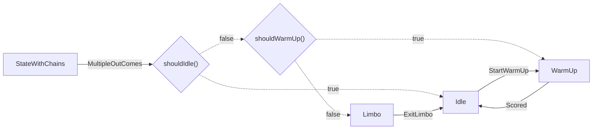

# Secretary of State

Convert csv state machine descriptions into mermaid markdown code.

## Installation

Installation requires python 3 and pip.

1. Clone the repositoryy
2. Pip install the current directory to add it to PATH

```
git clone https://github.com/aidnem/secretary-of-state
cd secretary-of-state
pip install -e .
```

This will add the `secretary` command to path

## Usage

To use secretary, simply pass in a path to a csv file:

```bash
secretary file.csv
```

This will spit the output into stdout. To capture it into a file, use something
like the following:

```bash
secretary file.csv > file.md
```

If your state machine is very large/complex, it might be beneficial to combine
compound conditions (expressions with '&&' or '||') into single conditions to
simplify the diagram. Do this with the `-c` or `--combine` switch. Make sure to
always pass the file as the first argument, followed by the flag.

```bash
secretary file.csv -c > file.md
```

## Input Format

Secretary accepts a toml file in the following format (JSOn files and eventually java parsing are to come):

```toml
StateWithChains = [
    { trigger = "MultipleOutComes", condition = "shouldIdle()", destination = "Idle" },
    { trigger = "MultipleOutComes", condition = "shouldWarmUp()", destination = "WarmUp" },
    { trigger = "MultipleOutComes", destination = "Limbo" },
]

Limbo = [{ trigger = "ExitLimbo", destination = "Idle" }]

Idle = [{ trigger = "StartWarmUp", destination = "WarmUp" }]

WarmUp = [{ trigger = "Scored", destination = "Idle" }]
```

Each state should be defined as an array of objects. Each object must contain a `trigger` and `destination` field and can optionally contain a `condition` field if the transition is conditional. Transitions are evaluated in order, so if multiple conditional transitions use the same trigger, they will be rendered as flowing through the conditions in the order that they are defined.

The mermaid diagram generated by `secretary` from this output is the following:



These example files can be found in
[`simple.toml`](https://github.com/aidnem/secretary-of-state/blob/main/simple.toml)
and
[`simple.md`](https://github.com/aidnem/secretary-of-state/blob/main/simple.md).
