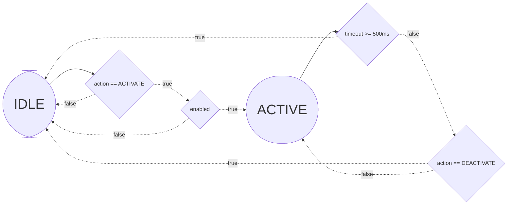

# Secretary of State

Convert csv state machine descriptions into mermaid markdown code.

## Installation

Installation requires python 3 and pip.

1. Clone the repositoryy
2. Pip install the current directory to add it to PATH

```
git clone https://github.com/aidnem/secretary-of-state
cd secretary-of-state
pip install -e .
```

This will add the `secretary` command to path

## Usage

To use secretary, simply pass in a path to a csv file:

```bash
secretary file.csv
```

This will spit the output into stdout. To capture it into a file, use something
like the following:

```bash
secretary file.csv > file.md
```

If your state machine is very large/complex, it might be beneficial to combine
compound conditions (expressions with '&&' or '||') into single conditions to
simplify the diagram. Do this with the `-c` or `--combine` switch. Make sure to
always pass the file as the first argument, followed by the flag.

```bash
secretary file.csv -c > file.md
```

## CSV Format

Secretary accepts a state machine table in the following format:

- Row 1 - A list of the states, beginning with a blank cell. This row serves as
  the labels for the columns below it.
- Rows 2 until end of file - Rows, beginning with the current state, where
  each cell contains the condition for the transition to the next state, which
  is the state written in the first row directly above the cell. To make a cell
  not include a transition, make its content one of the following:

  - `default`
  - `Not allowed`
  - `TBD`

  Conditions may use `&&` or `||` for conditionals that use and/or statements.
  These will be parsed and rendered as separate conditions with correct control
  flow by `secretary`. If the `-c` or `--combine` switch is specified, these
  'compound conditions' will remain un-parsed and combined into one condition,
  just as they appear in the table. This is useful for large or complex state
  machines.

### Example:

|        | IDLE                                       | ACTIVE                        |
| ------ | ------------------------------------------ | ----------------------------- |
| IDLE   | default                                    | action == ACTIVATE && enabled |
| ACTIVE | timeout >= 500ms \|\| action == DEACTIVATE | default                       |

In this example, `IDLE` can transition to `ACTIVE` if `action == ACTIVATE` and `enabled` is true.
`ACTIVE` can transition to `IDLE` if `timeout >= 500ms` or if
`action == DEACTIVATE`.

The csv for this table is shown below:

```
,IDLE,ACTIVE
IDLE,default,action == ACTIVATE && enabled
ACTIVE,timeout >= 500ms || action == DEACTIVATE,default
```

The mermaid diagram generated by `secretary` from this output is the following:



These example files can be found in
[`example.csv`](https://github.com/aidnem/secretary-of-state/blob/main/example.csv)
and
[`example.md`](https://github.com/aidnem/secretary-of-state/blob/main/example.md).
