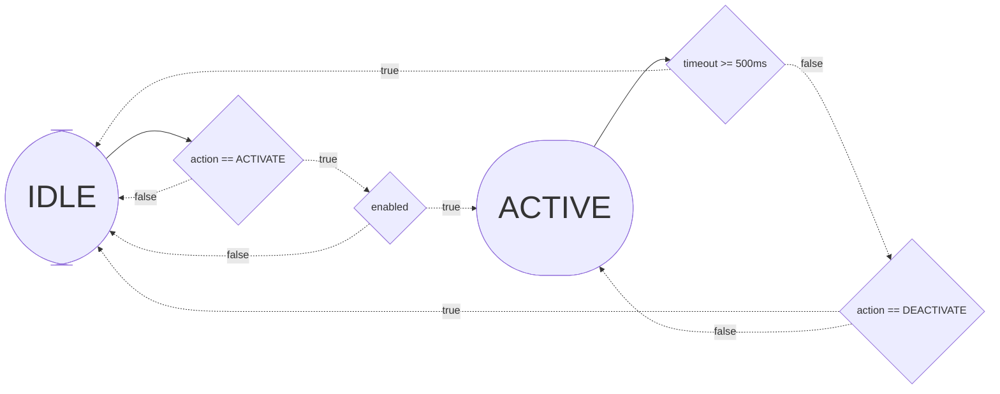

```mermaid
flowchart LR

classDef state font-size:40px,padding:10px

node0:::state
node0([<font size=11>IDLE])
node1:::state
node1([<font size=11>ACTIVE])
node0 --> node2
node2{"action == ACTIVATE"}
node2 -.->|true| node3
node2 -.->|false| node0
node3{"enabled"}
node3 -.->|true| node1
node3 -.->|false| node0
node1 --> node4
node4{"timeout >= 500ms"}
node4 -.->|true| node0
node4 -.->|false| node5
node5{"action == DEACTIVATE"}
node5 -.->|true| node0
node5 -.->|false| node1
```
