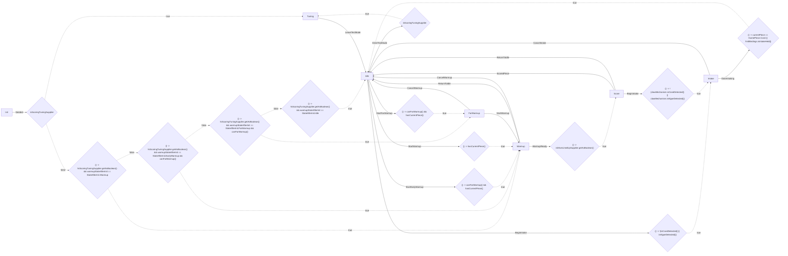

```mermaid
flowchart LR

classDef state font-size:40px,padding:10px

    Init -->|Seeded| InitCondition0{"isScoringTuningSupplier"}
    InitCondition0{"isScoringTuningSupplier"} -.->|true| Tuning
    InitCondition0{"isScoringTuningSupplier"} -.->|false| InitCondition1{"() -> !isScoringTuningSupplier.getAsBoolean() && warmupStateAfterInit == StateAfterInit.Warmup"}
    InitCondition1{"() -> !isScoringTuningSupplier.getAsBoolean() && warmupStateAfterInit == StateAfterInit.Warmup"} -.->|true| Warmup
    InitCondition1{"() -> !isScoringTuningSupplier.getAsBoolean() && warmupStateAfterInit == StateAfterInit.Warmup"} -.->|false| InitCondition2{"() -> !isScoringTuningSupplier.getAsBoolean() && warmupStateAfterInit == StateAfterInit.EarlyWarmup && canFarWarmup()"}
    InitCondition2{"() -> !isScoringTuningSupplier.getAsBoolean() && warmupStateAfterInit == StateAfterInit.EarlyWarmup && canFarWarmup()"} -.->|true| Warmup
    InitCondition2{"() -> !isScoringTuningSupplier.getAsBoolean() && warmupStateAfterInit == StateAfterInit.EarlyWarmup && canFarWarmup()"} -.->|false| InitCondition3{"() -> !isScoringTuningSupplier.getAsBoolean() && warmupStateAfterInit == StateAfterInit.FarWarmup && canFarWarmup()"}
    InitCondition3{"() -> !isScoringTuningSupplier.getAsBoolean() && warmupStateAfterInit == StateAfterInit.FarWarmup && canFarWarmup()"} -.->|true| FarWarmup
    InitCondition4{"() -> !isScoringTuningSupplier.getAsBoolean() && warmupStateAfterInit == StateAfterInit.Idle"} -.->|true| Idle
    InitCondition3{"() -> !isScoringTuningSupplier.getAsBoolean() && warmupStateAfterInit == StateAfterInit.FarWarmup && canFarWarmup()"} -.->|false| InitCondition4{"() -> !isScoringTuningSupplier.getAsBoolean() && warmupStateAfterInit == StateAfterInit.Idle"}
    Idle -->|BeginIntake| IdleCondition0{"() -> !(isCoralDetected() || isAlgaeDetected())"}
    IdleCondition0{"() -> !(isCoralDetected() || isAlgaeDetected())"} -.->|true| Intake
    Idle -->|StartEarlyWarmup| IdleCondition1{"() -> canFarWarmup() && hasCurrentPiece()"}
    IdleCondition1{"() -> canFarWarmup() && hasCurrentPiece()"} -.->|true| Warmup
    Idle -->|StartFarWarmup| IdleCondition2{"() -> canFarWarmup() && hasCurrentPiece()"}
    IdleCondition2{"() -> canFarWarmup() && hasCurrentPiece()"} -.->|true| FarWarmup
    Idle -->|StartWarmup| IdleCondition3{"() -> hasCurrentPiece()"}
    IdleCondition3{"() -> hasCurrentPiece()"} -.->|true| Warmup
    Idle -->|EnterTestMode| IdleCondition4{"isScoringTuningSupplier"}
    IdleCondition4{"isScoringTuningSupplier"} -.->|true| Tuning
    Tuning -->|LeaveTestMode| Idle
    Intake -->|DoneIntaking| IntakeCondition0{"() -> currentPiece == GamePiece.Coral || !InitBindings.isIntakeHeld()"}
    IntakeCondition0{"() -> currentPiece == GamePiece.Coral || !InitBindings.isIntakeHeld()"} -.->|true| Idle
    Intake -->|CancelIntake| Idle
    Warmup -->|WarmupReady| WarmupCondition0{"() -> isDriveLinedUpSupplier.getAsBoolean()"}
    WarmupCondition0{"() -> isDriveLinedUpSupplier.getAsBoolean()"} -.->|true| Score
    Warmup -->|ReturnToIdle| Idle
    Warmup -->|CancelWarmup| Idle
    FarWarmup -->|StartWarmup| Warmup
    FarWarmup -->|CancelWarmup| Idle
    Score -->|ScoredPiece| Idle
    Score -->|ReturnToIdle| Idle
    Score -->|BeginIntake| ScoreCondition0{"() -> !(clawMechanism.isCoralDetected() || clawMechanism.isAlgaeDetected())"}
    ScoreCondition0{"() -> !(clawMechanism.isCoralDetected() || clawMechanism.isAlgaeDetected())"} -.->|true| Intake
```
