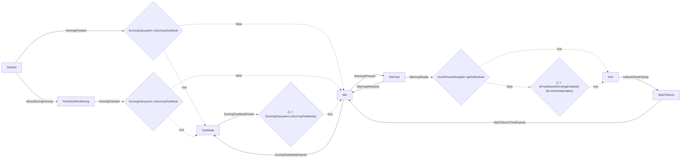

```mermaid
flowchart LR

classDef state font-size:40px,padding:10px

    StartInit -->|HomingFinished| StartInitCondition0{"ScoringSubsystem::inScoringTestMode"}
    StartInitCondition0{"ScoringSubsystem::inScoringTestMode"} -.->|true| TestMode
    StartInitCondition0{"ScoringSubsystem::inScoringTestMode"} -.->|false| Idle
    StartInit -->|MovedDuringHoming| FinishInitAfterMoving
    FinishInitAfterMoving -->|HomingFinished| FinishInitAfterMovingCondition0{"ScoringSubsystem::inScoringTestMode"}
    FinishInitAfterMovingCondition0{"ScoringSubsystem::inScoringTestMode"} -.->|true| TestMode
    FinishInitAfterMovingCondition0{"ScoringSubsystem::inScoringTestMode"} -.->|false| Idle
    TestMode -->|ScoringTestModeExited| TestModeCondition0{"() -> !ScoringSubsystem.inScoringTestMode()"}
    TestModeCondition0{"() -> !ScoringSubsystem.inScoringTestMode()"} -.->|true| Idle
    Idle -->|WarmupPressed| Warmup
    Idle -->|ScoringTestModeEntered| TestMode
    Warmup -->|WarmupReady| WarmupCondition0{"shootPressedSupplier::getAsBoolean"}
    WarmupCondition0{"shootPressedSupplier::getAsBoolean"} -.->|true| Kick
    WarmupCondition1{"() -> isPoseBasedShootingEnabled() && isShotAttainable()"} -.->|true| Kick
    WarmupCondition0{"shootPressedSupplier::getAsBoolean"} -.->|false| WarmupCondition1{"() -> isPoseBasedShootingEnabled() && isShotAttainable()"}
    Warmup -->|WarmupReleased| Idle
    Kick -->|IndexerDoneKicking| WaitToScore
    WaitToScore -->|WaitToScoreTimeExpired| Idle
```
