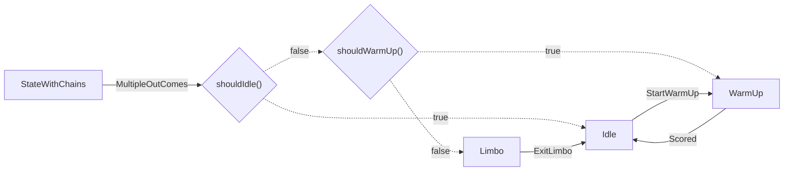

```mermaid
flowchart LR

classDef state font-size:40px,padding:10px

    StateWithChains -->|MultipleOutComes| StateWithChainsCondition0{"shouldIdle()"}
    StateWithChainsCondition0{"shouldIdle()"} -.->|true| Idle
    StateWithChainsCondition0{"shouldIdle()"} -.->|false| StateWithChainsCondition1{"shouldWarmUp()"}
    StateWithChainsCondition1{"shouldWarmUp()"} -.->|true| WarmUp
    StateWithChainsCondition1{"shouldWarmUp()"} -.->|false| Limbo
    Limbo -->|ExitLimbo| Idle
    Idle -->|StartWarmUp| WarmUp
    WarmUp -->|Scored| Idle
```
