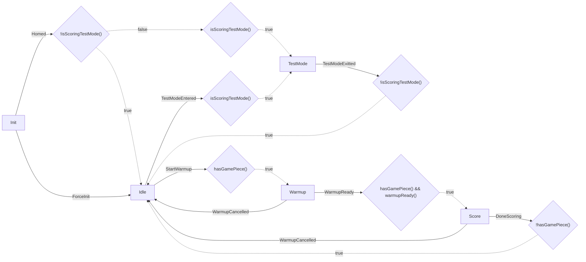

{'Init': [{'trigger': 'Homed', 'condition': '!isScoringTestMode()', 'destination': 'Idle'}, {'trigger': 'Homed', 'condition': 'isScoringTestMode()', 'destination': 'TestMode'}, {'trigger': 'ForceInit', 'destination': 'Idle'}], 'Idle': [{'trigger': 'StartWarmup', 'condition': 'hasGamePiece()', 'destination': 'Warmup'}, {'trigger': 'TestModeEntered', 'condition': 'isScoringTestMode()', 'destination': 'TestMode'}], 'TestMode': [{'trigger': 'TestModeExitted', 'condition': '!isScoringTestMode()', 'destination': 'Idle'}], 'Warmup': [{'trigger': 'WarmupCancelled', 'destination': 'Idle'}, {'trigger': 'WarmupReady', 'condition': 'hasGamePiece() && warmupReady()', 'destination': 'Score'}], 'Score': [{'trigger': 'DoneScoring', 'condition': '!hasGamePiece()', 'destination': 'Idle'}, {'trigger': 'WarmupCancelled', 'destination': 'Idle'}]}

